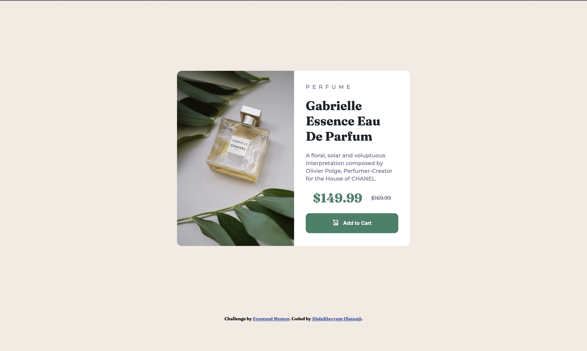
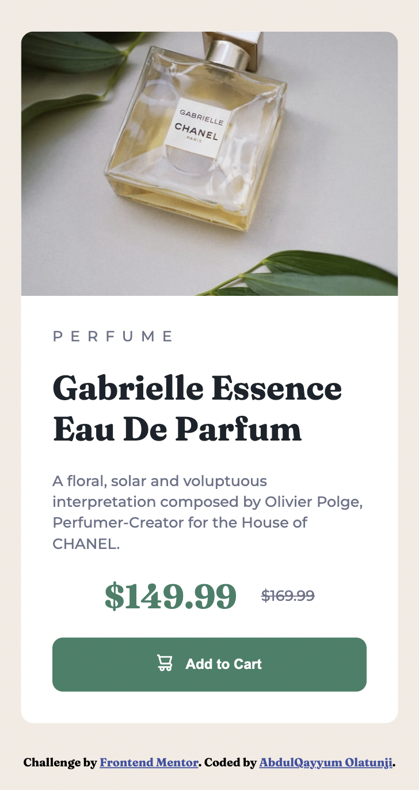

# Frontend Mentor - Product preview card component solution

This is a solution to the [Product preview card component challenge on Frontend Mentor](https://www.frontendmentor.io/challenges/product-preview-card-component-GO7UmttRfa). Frontend Mentor challenges help you improve your coding skills by building realistic projects.

## Table of contents

- [Overview](#overview)
  - [The challenge](#the-challenge)
  - [Screenshot](#screenshot)
  - [Links](#links)
- [My process](#my-process)
  - [Built with](#built-with)
  - [What I learned](#what-i-learned)
  - [Continued development](#continued-development)
  - [Author](#author)

## Overview

### The challenge

Users should be able to:

- View the optimal layout depending on their device's screen size
- See hover and focus states for interactive elements

### Screenshot





### Links

- Solution URL: [GitHub](https://github.com/Qayyax/product-review-card-component)
- Live Site URL: [Deployed Site](https://productreview1.netlify.app/)

## My process

I started with the Basic HTML syntax, and then styled with CSS using mostly flexbox and class selectors.

I used `display: none` to show desktop product image for desktop site while not showing the mobile image which was also in the HTML.

### Built with

- Semantic HTML5 markup
- CSS custom properties
- Flexbox

### What I learned

I learnt how to use `display: none` to put 2 different images in a div, but only show one for a screen size, while now taking over the space in the page.

```html


```

```css
/* Desktop Site */
.product-details {
  padding: 30px;
  display: flex;
  flex-direction: column;
  justify-content: center;
  row-gap: 20px;
}
.product-mobile {
  display: none;
}

/* Media querry */
.product {
  display: none;
}
.product-mobile {
  display: block;
  width: 90vw;
  border-top-left-radius: 12px;
  border-top-right-radius: 12px;
}
```

### Continued development

I plan to learn more JavaScript, so that I can add more functionality to webpages

- Website - [GitHub](https://github.com/Qayyax)
- Frontend Mentor - [@Qayyax](https://www.frontendmentor.io/profile/Qayyax)
- Twitter - [@qayyax](https://www.twitter.com/qayyax)
